# Architecture

## Services Involved

| # | Service | API Base | Role | Why It's Needed |
|---|---------|----------|------|-----------------|
| 1 | **Global Numbers** | `GET /v2/available_phone_numbers` → `POST /v2/number_orders` | Search & purchase SMS-capable numbers | You need a "from" number registered with carriers to send marketing SMS. |
| 2 | **Messaging Profiles** | `POST /v2/messaging_profiles` | Group SMS configuration | Webhook URLs, delivery settings, number pool config, opt-out handling. Required before sending any messages. |
| 3 | **10DLC Registration** | `POST /v2/10dlc/brand` → `POST /v2/10dlc/campaignBuilder` | US carrier compliance | Register your brand and MARKETING/MIXED campaign with TCR. Without this, US carriers will filter/block your SMS. |
| 4 | **SMS API** | `POST /v2/messages` | Send marketing messages | Core message delivery — single sends with rate limiting, scheduling support, and number pool distribution. |
| 5 | **Number Lookup** | `GET /v2/number_lookup/{phone}` | List hygiene & validation | Detect carrier type (mobile/landline/VoIP) before sending. Filter non-SMS numbers to reduce bounces and costs. |
| 6 | **Webhooks** | Configured on messaging profile | Delivery receipts & opt-out events | Real-time delivery status (`message.sent`, `message.finalized`), inbound messages (`message.received`), and opt-out detection (`autoresponse_type`). |

## Flow Diagram (ASCII)

```
┌─────────────────────────────────────────────────────────────────────────────┐
│                        SMS MARKETING PIPELINE                               │
│                                                                             │
│   ═══════════════════════ SETUP PHASE (One-Time) ═══════════════════════   │
│                                                                             │
│   ┌──────────────┐    ┌──────────────────┐    ┌──────────────────────┐     │
│   │   Global     │    │   Messaging       │    │   10DLC              │     │
│   │   Numbers    │───►│   Profile         │    │   Registration       │     │
│   │              │    │                    │    │                      │     │
│   │  Search &    │    │  Webhook URLs,     │    │  1. Register Brand   │     │
│   │  Purchase    │    │  whitelisted_      │    │  2. Wait for Vetting │     │
│   │  SMS-capable │    │  destinations,     │    │     (1-7 biz days)  │     │
│   │  number(s)   │    │  opt-out config    │    │  3. Create Campaign  │     │
│   └──────────────┘    └──────────────────┘    │     (MARKETING/MIXED)│     │
│                                                │  4. Assign Numbers   │     │
│   Step 1               Step 2                  └──────────────────────┘     │
│   (parallel ↕)         (parallel ↕)            Steps 3-6 (sequential)      │
│                                                                             │
│   ═══════════════════ RUNTIME PHASE (Per Campaign) ════════════════════    │
│                                                                             │
│   ┌────────────────┐                                                        │
│   │ RECIPIENT LIST  │ CSV / database of phone numbers                       │
│   └───────┬────────┘                                                        │
│           │                                                                  │
│           ▼                                                                  │
│   ┌────────────────┐                                                        │
│   │ 1. PRE-FILTER  │ E.164 normalize, dedup, check suppression list        │
│   │    (local)     │                                                        │
│   └───────┬────────┘                                                        │
│           │                                                                  │
│           ▼                                                                  │
│   ┌────────────────┐                                                        │
│   │ 2. LIST HYGIENE│ Number Lookup API: filter landlines, invalid,          │
│   │   (API calls)  │ toll-free, pager. Keep mobile + (optionally) VoIP.    │
│   │                │ GET /v2/number_lookup/{phone} — batch with rate limit  │
│   └───────┬────────┘                                                        │
│           │                                                                  │
│           ▼                                                                  │
│   ┌────────────────┐                                                        │
│   │ 3. BATCH SEND  │ POST /v2/messages — rate-limited (token bucket)       │
│   │   (rate-limit) │ Timezone-aware scheduling, TCPA quiet hours           │
│   │                │ 50 MPS account max, per-number limits by type          │
│   └───────┬────────┘                                                        │
│           │                                                                  │
│           ▼                                                                  │
│   ┌────────────────┐                                                        │
│   │ 4. DLR TRACK   │ Webhooks: message.sent → message.finalized            │
│   │   (webhooks)   │ Track: delivered, delivery_failed, sending_failed,    │
│   │                │ delivery_unconfirmed, expired                          │
│   └───────┬────────┘                                                        │
│           │                                                                  │
│           ▼                                                                  │
│   ┌────────────────┐                                                        │
│   │ 5. OPT-OUT     │ Inbound webhook: message.received                     │
│   │   HANDLING     │ autoresponse_type: STOP → suppress                    │
│   │                │ autoresponse_type: START → re-subscribe               │
│   │                │ Telnyx auto-blocks at platform level (40300 error)    │
│   └────────────────┘                                                        │
│                                                                             │
└─────────────────────────────────────────────────────────────────────────────┘
```

## Mermaid Diagram

```mermaid
graph TD
    subgraph "One-Time Infrastructure Setup"
        A1[1. Search & Buy SMS Number] --> A3[3. Assign Number to Profile]
        A2[2. Create Messaging Profile] --> A3
        A3 --> A4[4. Register 10DLC Brand — $4]
        A4 --> A5{Brand Verified?}
        A5 -->|Poll GET /v2/10dlc/brand/id| A5
        A5 -->|VERIFIED| A6[5. Create MARKETING Campaign]
        A6 --> A7[6. Assign Number to Campaign]
    end

    subgraph "Per-Campaign Runtime"
        B1[Recipient List] --> B2[Pre-Filter: E.164 normalize, dedup, suppressions]
        B2 --> B3[List Hygiene: Number Lookup API]
        B3 -->|mobile| B4[Clean Send List]
        B3 -->|landline/toll-free| B5[❌ Exclude]
        B3 -->|VoIP| B6[⚠️ Optional Include]
        B6 --> B4
        
        B4 --> B7[Batch Send: POST /v2/messages]
        B7 -->|Rate-limited, TZ-aware| B8[Telnyx Carrier Network]
        
        B8 --> B9{Delivery Status}
        B9 -->|message.finalized| B10[✅ Delivered]
        B9 -->|message.finalized| B11[❌ Failed]
        B9 -->|message.finalized| B12[⚠️ Unconfirmed]
        
        B8 --> B13[Recipient Replies STOP]
        B13 -->|message.received + autoresponse_type| B14[Add to Suppression List]
    end
```



## Dependency Graph

### Setup Phase (One-time)

```
Step 1: Search & Purchase Phone Number(s)
  ├── Prerequisites: Telnyx account with API key, sufficient balance
  ├── API: GET /v2/available_phone_numbers → POST /v2/number_orders
  ├── Output: phone_number (e.g., "+19705551234"), phone_number_id
  ├── Time: ~5 seconds
  └── ⚡ Can run in PARALLEL with Step 2

Step 2: Create Messaging Profile
  ├── Prerequisites: Webhook URL for delivery receipts
  ├── API: POST /v2/messaging_profiles
  ├── Key fields: webhook_url, whitelisted_destinations (REQUIRED), webhook_api_version
  ├── Output: messaging_profile_id
  ├── Time: ~2 seconds
  └── ⚡ Can run in PARALLEL with Step 1

Step 3: Assign Phone Number to Messaging Profile
  ├── Prerequisites: Step 1 (phone_number_id), Step 2 (messaging_profile_id)
  ├── API: PATCH /v2/phone_numbers/{id}/messaging
  ├── Output: Phone number linked to messaging profile
  └── Time: ~2 seconds

Step 4: Register 10DLC Brand ⚠️ CRITICAL PATH
  ├── Prerequisites: Business details (company name, EIN, address, website)
  ├── API: POST /v2/10dlc/brand
  ├── Output: brandId, identityStatus
  ├── Cost: $4 non-refundable
  ├── Time: Instant creation, but vetting takes 1-7 BUSINESS DAYS
  ├── ⚠️ BLOCKER: Cannot create campaigns until brand is VERIFIED
  └── ⚠️ No webhook for vetting — must poll (FRIC-006)

Step 5: Create 10DLC Campaign (MARKETING or MIXED)
  ├── Prerequisites: Step 4 (brandId must have identityStatus = VERIFIED)
  ├── API: POST /v2/10dlc/campaignBuilder
  ├── Key fields: usecase (MARKETING/MIXED), samples with opt-out language, messageFlow
  ├── Output: campaignId, campaignStatus
  ├── Time: Usually approved within minutes, can take up to 24 hours
  └── Note: Include branded URLs only (no URL shorteners)

Step 6: Assign Phone Number(s) to Campaign
  ├── Prerequisites: Step 5 (campaignId), Step 1 (phone_number)
  ├── API: POST /v2/10dlc/phone_number_campaigns
  ├── Output: Phone number(s) registered for A2P marketing
  └── Time: ~2 seconds (assignment), provisioning may take minutes
```

### Runtime Phase (Per Campaign)

```
Step A: Pre-Filter Recipient List (Local)
  ├── E.164 format normalization
  ├── Deduplication
  ├── Check suppression/opt-out list
  ├── Country code validation
  └── Time: milliseconds (local operations)

Step B: List Hygiene — Number Lookup
  ├── API: GET /v2/number_lookup/{phone_number} (per number, no bulk endpoint)
  ├── Batch with rate limiting: 50-100 req/sec recommended
  ├── Filter: Keep mobile, exclude landline/toll-free/premium/pager
  ├── Optional: Include VoIP (higher failure risk)
  ├── Cost: $0.0025/query (carrier) or $0.0015/query (LRN)
  └── Time: ~100K numbers in 15-30 minutes at 80 req/sec

Step C: Batch Send
  ├── API: POST /v2/messages (one at a time, no batch endpoint)
  ├── Rate limiting: Token bucket at 80% of capacity
  │   ├── Toll-free: 20 MPS per number (50 MPS account max)
  │   ├── 10DLC (top tier): ~75 MPS per campaign
  │   ├── 10DLC (mid tier): ~40 MPS per campaign
  │   └── 10DLC (low tier): ~4 MPS per campaign
  ├── Timezone-aware scheduling: Send at local 10 AM per zone
  ├── TCPA quiet hours: No sends before 8 AM or after 9 PM recipient local time
  └── Time: 100K messages at 20 MPS ≈ 83 minutes

Step D: Delivery Tracking (Webhooks)
  ├── message.sent → intermediate status (carrier accepted)
  ├── message.finalized → terminal status (delivered/failed/expired)
  ├── Track per-message: cost, status, carrier, error codes
  └── Use data.id (webhook event ID) as idempotency key

Step E: Opt-Out Processing
  ├── message.received with autoresponse_type: "STOP" → add to suppression
  ├── message.received with autoresponse_type: "START" → remove from suppression
  ├── Telnyx auto-blocks at platform level (API returns 40300 for blocked numbers)
  └── Also track in application DB for analytics and compliance
```

### Parallel Setup Opportunities

```
┌─────────────────────────────────────────────────────────┐
│ Time ──────────────────────────────────────────────────► │
│                                                          │
│ ┌─────────────┐                                          │
│ │ Step 1:     │                                          │
│ │ Buy Number  ├──┐                                       │
│ └─────────────┘  │  ┌──────────┐  ┌──────────────────┐  │
│                   ├─►│ Step 3:  ├─►│ Step 6:          │  │
│ ┌─────────────┐  │  │ Assign   │  │ Assign to        │  │
│ │ Step 2:     ├──┘  │ to Prof  │  │ Campaign         │  │
│ │ Msg Profile │     └──────────┘  └──────────────────┘  │
│ └─────────────┘                          ▲               │
│                                          │               │
│ ┌─────────────┐  ┌──────────────┐  ┌────┴──────────┐   │
│ │ Step 4:     ├─►│ WAIT 1-7     ├─►│ Step 5:       │   │
│ │ Brand Reg   │  │ BUSINESS DAYS│  │ Create        │   │
│ │ ($4)        │  │ (poll status)│  │ Campaign      │   │
│ └─────────────┘  └──────────────┘  └───────────────┘   │
│                                                          │
│ Steps 1+2 parallel ║ Step 4 starts anytime ║ Step 3     │
│ depends on 1+2 ║ Steps 5-6 depend on 4 verified        │
└─────────────────────────────────────────────────────────┘
```

### Critical Path Warning

```
⚠️ 10DLC Brand Vetting: 1-7 Business Days
   ─────────────────────────────────────────
   This is the longest wait in the entire setup.
   Brand vetting is performed by The Campaign Registry (TCR).
   
   There is NO webhook notification when vetting completes.
   You must poll: GET /v2/10dlc/brand/{brandId}
   Check: identityStatus field (FRIC-006)
   
   WORKAROUND: While waiting for brand vetting, you can:
   - Use a toll-free number for testing (no 10DLC required)
   - Set up everything else in parallel
   - Validate your recipient list (Number Lookup)
   - Build and test your webhook handler
```

## Rate Limit Reference

| Sender Type | Per-Number Rate | Account Max | Notes |
|-------------|----------------|-------------|-------|
| Toll-Free | 20 MPS | 50 MPS | Best for high-volume campaigns |
| 10DLC (Top Tier, score 75+) | ~75 MPS | 50 MPS | AT&T 4,500 TPM; T-Mobile 200K/day |
| 10DLC (Mid Tier, score 50-74) | ~40 MPS | 50 MPS | AT&T 2,400 TPM; T-Mobile 40K/day |
| 10DLC (Low Tier, score 1-49) | ~4 MPS | 50 MPS | AT&T 240 TPM; T-Mobile 2K-10K/day |
| 10DLC (Sole Proprietor) | ~0.25 MPS | 50 MPS | AT&T 15 TPM; T-Mobile 1K/day |
| Short Code | 1,000 MPS | 50 MPS | For massive campaigns |

## Webhook Event Types

| Event | Description | When |
|-------|-------------|------|
| `message.sent` | Message accepted by carrier gateway | After send, before delivery |
| `message.finalized` | Message reached terminal state | Delivered, failed, or expired |
| `message.received` | Inbound SMS/MMS to your number | Replies, opt-outs, HELP requests |

---

## Capacity Planning

| Campaign Size | Recommended Numbers | Why |
|---|---|---|
| < 10,000 recipients | 1–2 numbers | Sufficient for most campaigns |
| 10,000–50,000 | 3–5 numbers | Distribute carrier load |
| 50,000–200,000 | 5–10 numbers | Stay under T-Mobile daily cap |
| 200,000+ | Consider toll-free or short code | 10DLC daily caps become limiting |

---

## 10DLC Throughput by Vetting Score

| Vetting Score | AT&T SMS/min | T-Mobile Daily Cap |
|---|---|---|
| 75–100 (Top) | 4,500 | 200,000 |
| 50–74 (High) | 2,400 | 40,000 |
| 25–49 (Medium) | 240 | 10,000 |
| 1–24 (Basic) | 240 | 2,000 |
| Unvetted | 240 | 2,000 |

Aim for a score of 75+ by ensuring your website, EIN, email domain, and phone all match and are verifiable.

---

## Pre-Send Validation Pipeline

```
1. FORMAT VALIDATION (free) — normalize to E.164, remove invalid formats
2. DEDUPLICATION (free) — remove duplicate numbers
3. SUPPRESSION CHECK (free) — filter opt-outs, previous bounces, DNC list
4. CACHE CHECK (free) — skip recently validated numbers
5. NUMBER LOOKUP ($0.0025/query) — filter by carrier type
6. FINAL CLEAN LIST — mobile-only, opted-in, valid, not suppressed
```

After filtering, expect 5–15% reduction for organically-grown lists, 20–30% for purchased lists.

---

