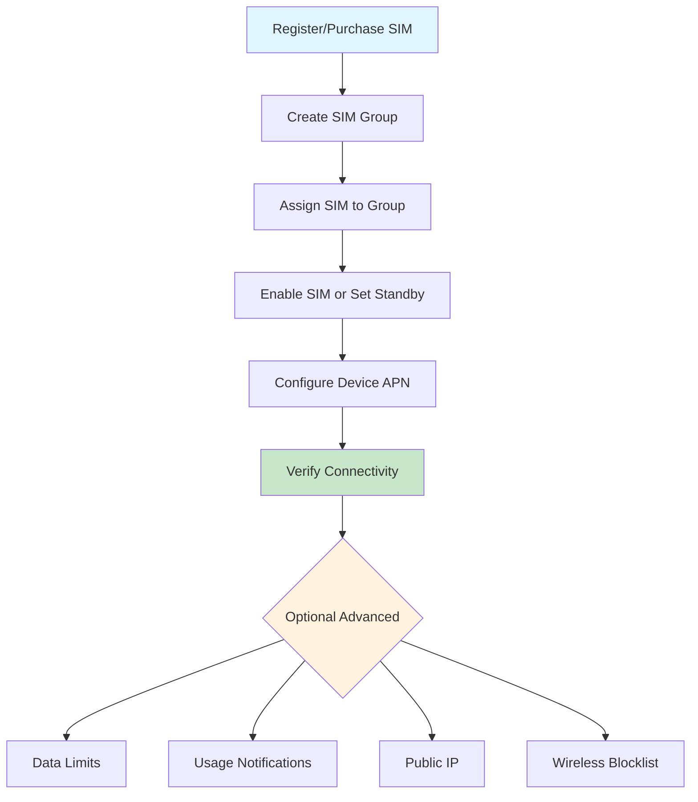

# IoT SIM Setup — Service Architecture

## Overview

Telnyx IoT SIM provisioning involves these services:

```
Customer Device (LTE/4G modem)
    ↓
Carrier Network (AT&T, Vodafone, etc.)
    ↓
Telnyx Mobile Packet Core (MPC)
    ↓
Telnyx Wireless API (api.telnyx.com/v2)
    ↓
Telnyx Mission Control Portal
```

## Dependency Graph



## Key Components

### SIM Card
- Uniquely identified by `id` (UUID) and `iccid` (19-20 digit ICCID)
- Has an `imsi` (IMSI — identifies the home network, e.g., `31121039379xxxxx` for Telnyx US)
- `status.value` transitions: `registered` → `enabled` / `standby` / `disabled`
- `live_data_session`: `connected` / `disconnected` / `unknown`
- `type`: `physical` (plastic SIM) or `esim` (eSIM profile)

### SIM Card Group
- Organizes SIMs for billing, data pooling, and bulk actions
- A SIM must be in a group before it can be enabled
- Groups can have data limits and wireless blocklists

### Wireless Connectivity Logs
- Per-SIM logs showing registration and data session events
- `log_type: registration` — SIM attach/detach to carrier network
- `log_type: data` — data session establishment and teardown
- Includes `apn`, `ipv4`, `ipv6`, `imei`, `imsi`, `mobile_country_code`, `mobile_network_code`, `radio_access_technology`

### Multi-IMSI Technology
- Telnyx SIMs are eUICC with multiple IMSI profiles
- IMSI1 (311210...) — Telnyx US primary
- IMSI5 — US fallback (workaround for IMSI1 Americas incidents)
- IMSI2 — International/EU
- OTA updates can switch IMSI profiles remotely

### APN
- **`data00.telnyx`** — the correct APN for all Telnyx IoT SIMs
- No username or password required
- PDP type: IPv4 (IPv6 also supported on some carriers)
