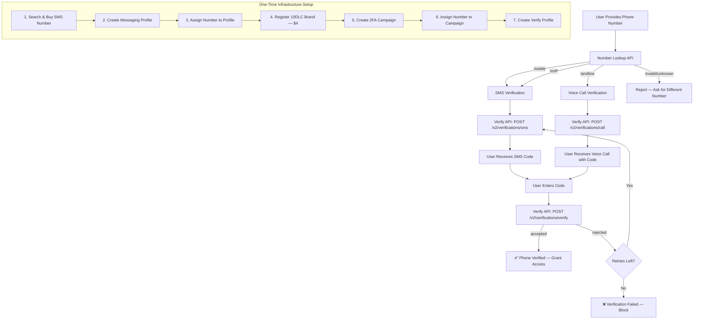

# Architecture

## Services Involved

| # | Service | API Base | Role | Why It's Needed |
|---|---------|----------|------|-----------------|
| 1 | **Number Lookup** | `GET /v2/number_lookup/{phone}` | Pre-validate phone numbers | Detect line type (mobile/landline/VoIP) before sending. Avoid wasting OTPs on landlines. |
| 2 | **Global Numbers** | `GET /v2/available_phone_numbers` | Search & purchase SMS-capable numbers | You need a "from" number registered with carriers to send SMS. |
| 3 | **Number Orders** | `POST /v2/number_orders` | Purchase selected numbers | Completes the phone number acquisition. |
| 4 | **Messaging Profiles** | `POST /v2/messaging_profiles` | Group SMS configuration | Webhook URLs, delivery settings, number pool config. Required before sending any messages. |
| 5 | **10DLC Registration** | `POST /v2/10dlc/brand` | US carrier compliance | Register your brand and campaign with The Campaign Registry (TCR). Without this, US carriers will filter/block your SMS. |
| 6 | **Verify API** | `POST /v2/verify_profiles` | OTP generation & verification | Handles code generation, delivery, expiry tracking, and verification. The core service. |

## Flow Diagram (ASCII)

```
┌─────────────────────────────────────────────────────────────────────────┐
│                          YOUR APPLICATION                               │
│                                                                         │
│   User signs up ──► Collect phone number ──► Trigger verification       │
│                                               │                         │
│                                               ▼                         │
│                                      ┌─────────────────┐               │
│                                      │  Number Lookup   │               │
│                                      │  GET /v2/number_ │               │
│                                      │  lookup/{phone}  │               │
│                                      └────────┬────────┘               │
│                                               │                         │
│                                    ┌──────────┼──────────┐             │
│                                    │          │          │              │
│                                    ▼          ▼          ▼              │
│                                 mobile    landline    VoIP              │
│                                    │          │          │              │
│                                    ▼          ▼          ▼              │
│                              SMS OTP    Voice OTP   SMS OTP             │
│                                    │          │          │              │
│                                    └──────────┼──────────┘             │
│                                               │                         │
│                                               ▼                         │
│                                      ┌─────────────────┐               │
│                                      │   Verify API     │               │
│                                      │  POST /v2/       │               │
│                                      │  verifications/  │               │
│                                      │  {sms|call}      │               │
│                                      └────────┬────────┘               │
│                                               │                         │
│                                         Code sent                       │
│                                               │                         │
│                                               ▼                         │
│                                      User enters code                   │
│                                               │                         │
│                                               ▼                         │
│                                      ┌─────────────────┐               │
│                                      │   Verify API     │               │
│                                      │  POST /v2/       │               │
│                                      │  verifications/  │               │
│                                      │  {id}/actions/   │               │
│                                      │  verify          │               │
│                                      └────────┬────────┘               │
│                                               │                         │
│                                        ┌──────┴──────┐                  │
│                                        │             │                  │
│                                    accepted       rejected              │
│                                        │             │                  │
│                                        ▼             ▼                  │
│                                  Grant access   Retry / Block           │
└─────────────────────────────────────────────────────────────────────────┘

                    INFRASTRUCTURE LAYER (One-time Setup)

┌─────────────────────────────────────────────────────────────────────────┐
│                                                                         │
│   ┌──────────────┐    ┌──────────────────┐    ┌──────────────────┐     │
│   │   Global     │    │   Messaging       │    │   10DLC          │     │
│   │   Numbers    │───►│   Profile         │───►│   Registration   │     │
│   │              │    │                    │    │                  │     │
│   │  Search &    │    │  Webhook URLs,     │    │  Brand + Campaign│     │
│   │  Purchase    │    │  delivery config   │    │  registration    │     │
│   │  SMS-capable │    │                    │    │  with TCR        │     │
│   │  number      │    │                    │    │                  │     │
│   └──────────────┘    └──────────────────┘    └──────────────────┘     │
│                                                                         │
│   Step 1               Step 2                   Step 3                  │
│   Buy number           Create profile &         Register brand,         │
│   with SMS             assign number            create 2FA campaign,    │
│   capability                                    assign numbers          │
│                                                                         │
│                        ┌──────────────────┐                             │
│                        │   Verify Profile  │                             │
│                        │                    │                             │
│                        │  OTP settings:     │                             │
│                        │  code length,      │                             │
│                        │  timeout, app name │                             │
│                        │  whitelisted       │                             │
│                        │  destinations      │                             │
│                        └──────────────────┘                             │
│                        Step 4                                            │
│                        Configure OTP delivery                            │
└─────────────────────────────────────────────────────────────────────────┘
```

## Mermaid Diagram



## Dependency Graph

### Setup Phase (One-time, Sequential)

```
Step 1: Search & Purchase Phone Number
  ├── Prerequisites: Telnyx account with API key, sufficient balance
  ├── API: GET /v2/available_phone_numbers → POST /v2/number_orders
  ├── Output: phone_number (e.g., "+19705551234"), phone_number_id
  └── Time: ~5 seconds

Step 2: Create Messaging Profile
  ├── Prerequisites: None (can be done in parallel with Step 1)
  ├── API: POST /v2/messaging_profiles
  ├── Output: messaging_profile_id
  └── Time: ~2 seconds

Step 3: Assign Phone Number to Messaging Profile
  ├── Prerequisites: Step 1 (phone_number_id), Step 2 (messaging_profile_id)
  ├── API: PATCH /v2/phone_numbers/{id}/messaging
  ├── Output: Phone number now linked to messaging profile
  └── Time: ~2 seconds

Step 4: Register 10DLC Brand ⚠️ CRITICAL PATH
  ├── Prerequisites: Business details (company name, EIN, address)
  ├── API: POST /v2/10dlc/brand
  ├── Output: brandId, tcrBrandId
  ├── Cost: $4 non-refundable
  ├── Time: Instant creation, but vetting takes 1-7 BUSINESS DAYS
  └── ⚠️ BLOCKER: Cannot create campaigns until brand is VERIFIED

Step 5: Create 10DLC Campaign
  ├── Prerequisites: Step 4 (brandId must have identityStatus = VERIFIED)
  ├── API: POST /v2/10dlc/campaignBuilder
  ├── Output: campaignId
  ├── Time: Usually approved within minutes, but can take up to 24 hours
  └── Note: Use usecase = "2FA" for phone verification

Step 6: Assign Phone Number to Campaign
  ├── Prerequisites: Step 5 (campaignId), Step 1 (phone_number)
  ├── API: POST /v2/10dlc/phone_number_campaigns
  ├── Output: Phone number registered for A2P messaging
  └── Time: ~2 seconds (assignment), provisioning may take minutes

Step 7: Create Verify Profile
  ├── Prerequisites: None (can be created anytime)
  ├── API: POST /v2/verify_profiles
  ├── Output: verify_profile_id
  └── Time: ~2 seconds
```

### Runtime Phase (Per-Verification)

```
Step A: Pre-validate Phone Number
  ├── API: GET /v2/number_lookup/{phone_number}
  ├── Output: carrier.type (mobile/landline/VoIP)
  ├── Decision: mobile/VoIP → SMS, landline → Call
  └── Time: ~200ms

Step B: Trigger Verification
  ├── API: POST /v2/verifications/sms (or /call for landlines)
  ├── Input: phone_number, verify_profile_id
  ├── Output: verification_id, status = "accepted"
  └── Time: ~1 second (API), ~5-30 seconds (SMS delivery)

Step C: Verify Code
  ├── API: POST /v2/verifications/{id}/actions/verify
  │   OR: POST /v2/verifications/by_phone_number/{phone}/actions/verify
  ├── Input: code (from user), verify_profile_id (if using phone number method)
  ├── Output: response_code = "accepted" or "rejected"
  └── Time: ~200ms
```

### Critical Path Warning

```
⚠️ 10DLC Brand Vetting: 1-7 Business Days
   ─────────────────────────────────────────
   This is the longest wait in the entire setup.
   Brand vetting is performed by The Campaign Registry (TCR).
   
   There is NO webhook notification when vetting completes.
   You must poll: GET /v2/10dlc/brand/{brandId}
   Check: identityStatus field
   
   WORKAROUND: While waiting for brand vetting, you can:
   - Use a toll-free number for testing (no 10DLC required)
   - Set up everything else in parallel
   - Use mock=true on brand creation for development
```

## Entity Types

| Entity Type | Requirements |
|-------------|-------------|
| `PRIVATE_PROFIT` | Company name, EIN |
| `PUBLIC_PROFIT` | Company name, stock symbol, stock exchange |
| `NON_PROFIT` | Company name, EIN |
| `GOVERNMENT` | Company name, EIN |
| `SOLE_PROPRIETOR` | First name, last name, mobile phone for verification |

## Verify Profile Settings

| Setting | What it does | Recommended |
|---------|-------------|-------------|
| `code_length` | Number of digits in OTP | 6 (industry standard) |
| `default_verification_timeout_secs` | How long code is valid | 300 (5 minutes) |
| `whitelisted_destinations` | Which countries can receive | `["US", "CA"]` or `["*"]` for global |
| `app_name` | Shown in SMS: "Your {app_name} code is..." | Your brand name |
| `webhook_url` | Receives delivery status events | Your server URL |
