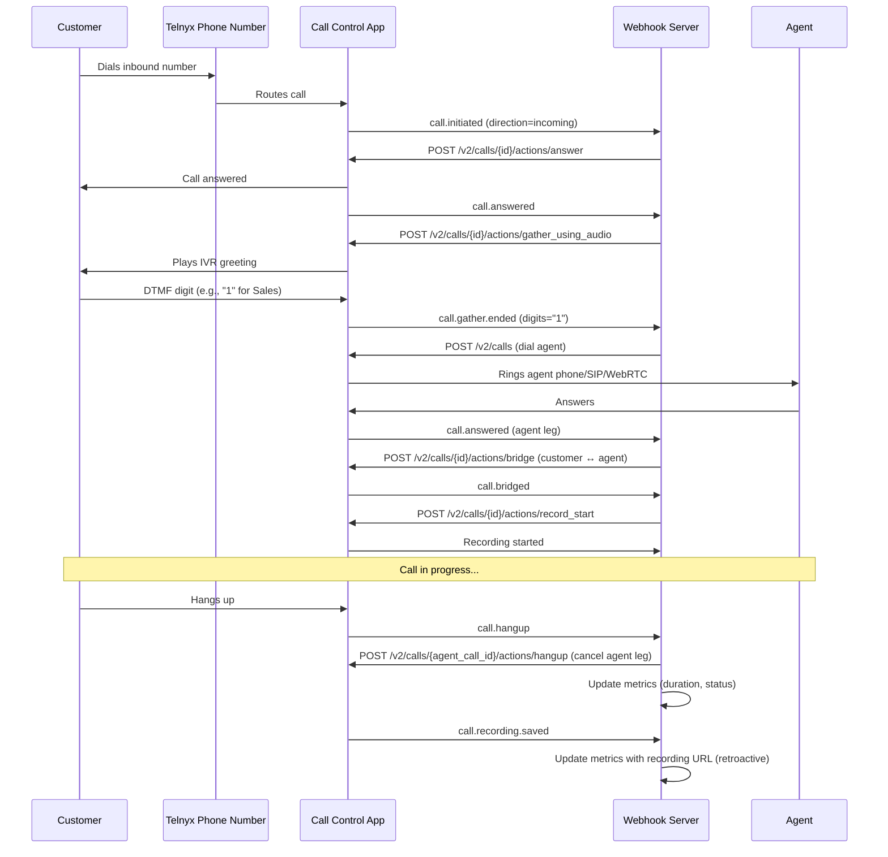

# Architecture — Telnyx Contact Center (AIF-273)

## Services Involved

| Service | API Endpoint | Role in Contact Center |
|---------|-------------|----------------------|
| Call Control | `POST /v2/calls`, `POST /v2/calls/{id}/actions/*` | Core call orchestration: answer, gather DTMF, bridge, hangup, transfer |
| Phone Numbers | `GET/POST /v2/phone_numbers` | Inbound DIDs that customers call |
| SIP Credential Connections | `POST /v2/credential_connections` | SIP softphone endpoints for agents (Path B) |
| WebRTC | `POST /v2/credential_connections` (with `credential_type: webrtc`) | Browser-based agent endpoints (Path C) |
| Outbound Voice Profiles | `POST/PATCH /v2/outbound_voice_profiles` | Whitelisted destinations for outbound agent dialing |
| Call Recording | `POST /v2/calls/{id}/actions/record_start` | Call recording with optional transcription |
| Call Analysis (Gather) | `POST /v2/calls/{id}/actions/gather_using_audio` | IVR DTMF collection from callers |
| Conferencing | `POST /v2/conferences` | Multi-party bridging (optional, for hold/transfer) |

## ASCII Flow Diagram

```
                          ┌──────────────┐
                          │  Customer    │
                          │  dials in    │
                          └──────┬───────┘
                                 │
                                 ▼
                    ┌────────────────────────┐
                    │  Telnyx Phone Number    │
                    │  (inbound DID)          │
                    └────────────┬───────────┘
                                 │
                                 ▼
                    ┌────────────────────────┐
                    │  Call Control App      │
                    │  (webhook URL)         │
                    └────────────┬───────────┘
                                 │
                                 ▼
                    ┌────────────────────────┐
                    │  Webhook Server        │
                    │  (Node.js/Express)     │
                    │                        │
                    │  call.initiated        │
                    │  → answer inbound      │
                    │  → ignore outbound     │
                    └────────────┬───────────┘
                                 │
                                 ▼
                    ┌────────────────────────┐
                    │  IVR Gather             │
                    │  (play greeting +      │
                    │   collect DTMF)         │
                    └────────────┬───────────┘
                                 │
                          DTMF digit (1/2/3...)
                                 │
              ┌──────────────────┼──────────────────┐
              ▼                  ▼                  ▼
     ┌────────────────┐ ┌────────────────┐ ┌────────────────┐
     │  Path A: Mobile │ │ Path B: SIP    │ │ Path C: WebRTC │
     │  Dial agent     │ │ Dial SIP URI   │ │ Dial WebRTC    │
     │  phone number   │ │ (softphone)    │ │ (browser)      │
     └───────┬────────┘ └───────┬────────┘ └───────┬────────┘
             │                  │                  │
             └──────────────────┼──────────────────┘
                                ▼
                    ┌────────────────────────┐
                    │  Bridge Calls          │
                    │  (customer ↔ agent)    │
                    └────────────┬───────────┘
                                 │
                                 ▼
                    ┌────────────────────────┐
                    │  Start Recording       │
                    │  (with transcription)   │
                    └────────────┬───────────┘
                                 │
                                 ▼
                    ┌────────────────────────┐
                    │  Call in progress      │
                    │  (monitor for hangup)   │
                    └────────────┬───────────┘
                                 │
                          call.hangup
                                 │
                                 ▼
                    ┌────────────────────────┐
                    │  Cleanup               │
                    │  - Cancel agent leg    │
                    │  - Update metrics      │
                    │  - Offer voicemail     │
                    │    if no-answer        │
                    └────────────┬───────────┘
                                 │
                          call.recording.saved
                                 │
                                 ▼
                    ┌────────────────────────┐
                    │  Update metrics with   │
                    │  recording URL          │
                    │  (retroactive)         │
                    └────────────────────────┘
```

## Mermaid Sequence Diagram



## Dependency Graph

```
Phone Number ─────────────────────► Call Control Application
                                        │
                                        ├──► Outbound Voice Profile
                                        │      (required for outbound agent dial)
                                        │
                                        ├──► SIP Credential Connections
                                        │      (Path B: SIP softphone agents)
                                        │
                                        ├──► WebRTC Credential Connections
                                        │      (Path C: browser agents)
                                        │
                                        └──► Webhook Server
                                               │
                                               ├──► Call Recording API
                                               │      (record_start on bridge)
                                               │
                                               ├──► Gather API
                                               │      (IVR DTMF collection)
                                               │
                                               └──► Conferencing API
                                                      (optional multi-party)
```

### Dependency Notes

| From | To | Dependency Type | Notes |
|------|----|----------------|-------|
| Phone Number | Call Control Application | `connection_id` assignment | Number must be assigned to CCA via `PATCH /v2/phone_numbers/{id}/voice` |
| Call Control Application | Outbound Voice Profile | `outbound_voice_profile_id` | Without OVP, all outbound calls fail with D38 |
| Outbound Voice Profile | Whitelisted Destinations | `whitelisted_destinations` array | Agent countries must be listed or calls fail silently with D13 |
| Call Control Application | Webhook Server | `webhook_event_url` | Must be HTTPS, reachable from Telnyx |
| Webhook Server | Call Recording API | `record_start` action | Called after bridge event |
| Webhook Server | Gather API | `gather_using_audio` action | Called after call.answered event |
| SIP Credential Connections | SIP Server | `sip.telnyx.com:5060` | Agents register softphones with these credentials |
| WebRTC Credential Connections | WebRTC Gateway | `sip.telnyx.com` | Agents use https://webrtc.telnyx.com with these credentials |
