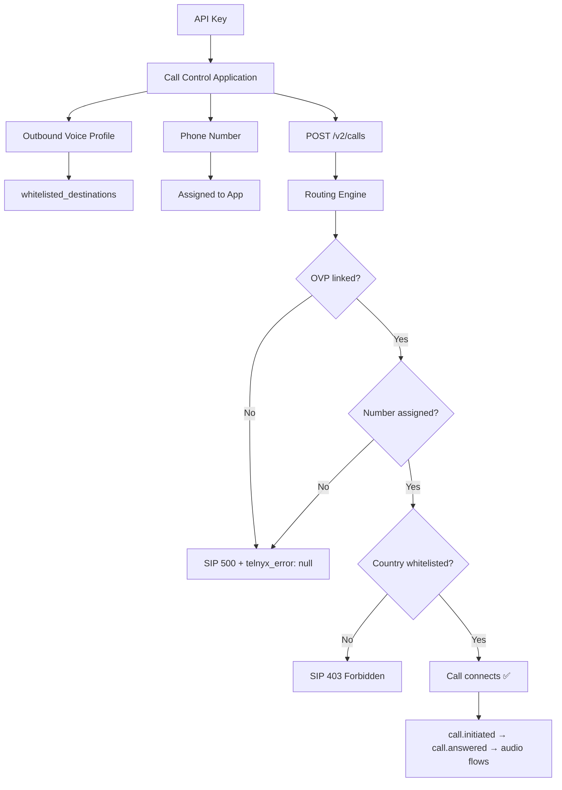

# Architecture — How Telnyx Voice Components Connect

## The Four-Component Chain

Every outbound call requires four components properly linked. Missing any one causes a silent failure.

```
┌─────────────────────────────────────────────────────────────────────┐
│                        YOUR TELNYX ACCOUNT                         │
│                                                                     │
│  ┌──────────────┐    ┌────────────────────────┐                    │
│  │   API Key     │───▶│  Call Control App      │                    │
│  └──────────────┘    │  (id: APP_ID)          │                    │
│                      └──────────┬───────────────┘                   │
│                                 │                                    │
│                    ┌────────────┴────────────┐                      │
│                    │                         │                       │
│                    ▼                         ▼                       │
│  ┌─────────────────────────┐  ┌──────────────────────────┐         │
│  │  Outbound Voice Profile  │  │  Phone Number             │        │
│  │  (id: OVP_ID)           │  │  +19705551234              │        │
│  │                          │  │  (assigned to app)        │        │
│  │  • whitelisted countries │  └──────────────────────────┘         │
│  │  • concurrent call limit │                                       │
│  │  • traffic type          │                                       │
│  └─────────────────────────┘                                        │
│                                                                     │
└─────────────────────────────────────────────────────────────────────┘
                              │
                              ▼
                    ┌─────────────────┐
                    │ POST /v2/calls   │
                    │ {                │
                    │   connection_id, │
                    │   to: "+1...",   │
                    │   from: "+1..."  │
                    │ }                │
                    └────────┬────────┘
                             │
                             ▼
                    ┌─────────────────┐
                    │ call.initiated    │ ← Call leg created
                    └────────┬────────┘
                             │
                             ▼
                    ┌─────────────────┐
                    │ Routing Engine    │
                    │                   │
                    │ Checks:           │
                    │ 1. App OK?        │
                    │ 2. OVP linked?    │ ← FAILS HERE if missing
                    │ 3. Number valid?  │
                    │ 4. Country OK?    │
                    └────────┬────────┘
                             │
                    ┌────────┴────────┐
                    │                  │
                    ▼                  ▼
             ┌──────────┐     ┌──────────────┐
             │  SUCCESS  │     │   FAILURE     │
             │           │     │               │
             │ call rings │     │ call.hangup   │
             │ call.answered│  │ SIP 500       │
             │ audio flows │  │ telnyx_error:  │
             │ call.hangup │  │   null         │
             └──────────┘     └──────────────┘
```

## Dependency Graph

```
API Key (authentication)
  │
  ├── Call Control Application
  │     │
  │     ├── Outbound Voice Profile ──── MUST BE LINKED to app
  │     │     │
  │     │     └── whitelisted_destinations ──── Controls which countries you can dial
  │     │
  │     └── Phone Number ──── MUST BE ASSIGNED to app
  │           │
  │           └── Used as "from" (caller ID) in POST /v2/calls
  │
  └── POST /v2/calls
        │
        ├── connection_id ──── References the Call Control Application
        ├── to ──── Destination phone number (E.164)
        └── from ──── Your Telnyx phone number (E.164)
```

## What Happens When Things Are Missing

| Missing Component | What Happens | Error You See |
|-------------------|-------------|---------------|
| API Key invalid | API returns 401 | `"Unauthorized"` |
| Call Control App doesn't exist | API returns 422 | `"connection_id is invalid"` |
| OVP not linked to app | Call initiates then immediately hangs up | SIP 500, `telnyx_error: null` |
| Phone number not assigned | Call initiates then hangs up | SIP 500 or immediate `call.hangup` |
| Country not in OVP whitelist | Call rejected at routing | SIP 403 Forbidden |
| Insufficient balance | Call rejected | `"insufficient funds"` |

## Call Flow — Success Path

```
Developer                Telnyx API              Routing Engine           PSTN
    │                        │                        │                    │
    │  POST /v2/calls        │                        │                    │
    │───────────────────────▶│                        │                    │
    │                        │  Validate request      │                    │
    │                        │  Create call leg       │                    │
    │  200 OK                │                        │                    │
    │  {call_control_id}     │                        │                    │
    │◀───────────────────────│                        │                    │
    │                        │  Route outbound        │                    │
    │                        │───────────────────────▶│                    │
    │                        │                        │  Check OVP         │
    │                        │                        │  Check destination │
    │                        │                        │  Check caller ID   │
    │                        │                        │                    │
    │                        │                        │  INVITE            │
    │                        │                        │───────────────────▶│
    │                        │                        │                    │
    │                        │                        │  180 Ringing       │
    │  webhook:              │                        │◀───────────────────│
    │  call.initiated        │◀───────────────────────│                    │
    │◀───────────────────────│                        │                    │
    │                        │                        │  200 OK (answer)   │
    │  webhook:              │                        │◀───────────────────│
    │  call.answered         │◀───────────────────────│                    │
    │◀───────────────────────│                        │                    │
    │                        │                        │                    │
    │                        │     ◀═══ RTP Audio ═══▶│                    │
    │                        │                        │                    │
    │                        │                        │  BYE               │
    │  webhook:              │                        │◀───────────────────│
    │  call.hangup           │◀───────────────────────│                    │
    │◀───────────────────────│                        │                    │
```

## Call Flow — Failure Path (No OVP)

```
Developer                Telnyx API              Routing Engine
    │                        │                        │
    │  POST /v2/calls        │                        │
    │───────────────────────▶│                        │
    │                        │  Validate request      │
    │                        │  Create call leg       │
    │  200 OK                │                        │
    │  {call_control_id}     │  ← Looks successful!   │
    │◀───────────────────────│                        │
    │                        │  Route outbound        │
    │                        │───────────────────────▶│
    │                        │                        │  Check OVP
    │                        │                        │  ❌ NO OVP FOUND
    │                        │                        │
    │  webhook:              │  SIP 500               │
    │  call.initiated        │◀───────────────────────│
    │◀───────────────────────│                        │
    │                        │                        │
    │  webhook:              │  Tear down call        │
    │  call.hangup           │◀───────────────────────│
    │  telnyx_error: null    │                        │
    │◀───────────────────────│                        │
```

The key insight: the API returns `200 OK` with a `call_control_id` even when the call is going to fail. The failure happens asynchronously during routing and only shows up in webhook events — with no useful error message.

## Mermaid Diagram


